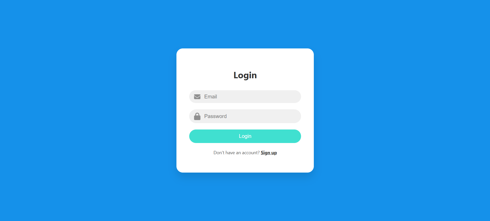

# 📊 Full Stack Dashboard App

A responsive dashboard web application built using:
- ⚛️ **React.js** for the frontend
- 🌐 **Node.js + Express** for the backend
- 🐘 **PostgreSQL** as the database
- 🔗 Connected via REST API

---

## 🖼️ Project Preview

### 📱 Login Page

### 🧩 Main Dashboard View

---

## 📁 Project Structure

- `client/` – React frontend  
- `server/` – Node + Express backend  
- `database/` – PostgreSQL schema  

